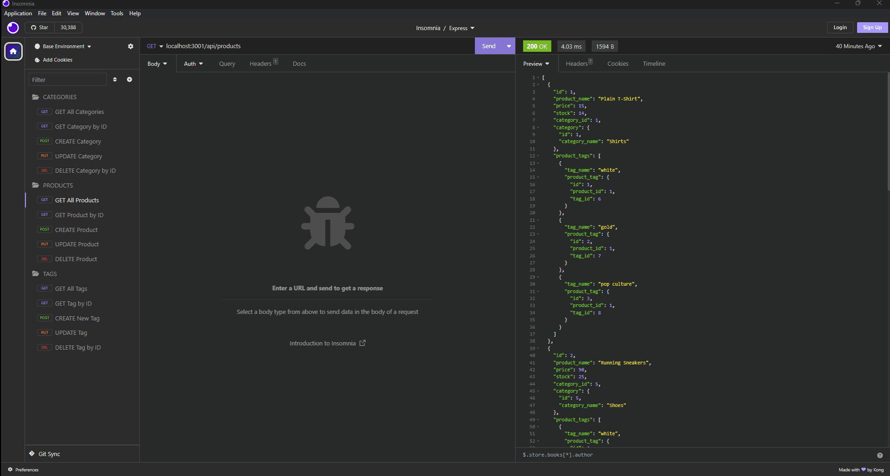

# e-commerce-backend

## Description

Using MySQL and Sequelize to connect to MySQL database you're able to start your server. Utilizing Insomnia core you can GET all models, GET each model by ID, POST, PUT, and DELETE the models.  

## Table of Contents

* [Description](#description)
* [Installation](#installation)
* [Usage](#usage)
* [Walkthrough Video](#walkthrough-video)

## Installation

Clone repo then run the following line of code in your terminal to install all the needed packages:
```
npm i
```

## Usage
Run this command into your terminal

```
mysql -u root -p
```
Enter your MySQL password 
```
source db/schema.sql
```

```
quit;
```

```
npm run seed
```

```
npm start
```


## Walkthrough Video

[Link](https://drive.google.com/file/d/1_73ZGfYqZGVMRuduBS5ZInO3rEaJYk_o/view)
